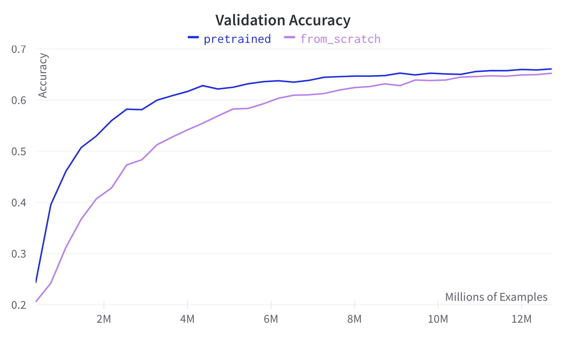

# Moonshine

**Moonshine** is a Python library that makes it easy for remote sensing researchers,
professionals, and enthusists to develop ML models on their data. It provides
[pre-trained models](getting_started/models.md) across a variety of
[datasets](https://moonshineai.readthedocs.io/en/latest/getting_started/preprocessing.html#dataset)
and architectures, allowing you to reduce your labeling costs and compute requirements
for your own application.

## Why Use Moonshine?

1. **Pretrained on multispectral data**: Many existing packages are pretrained with
   ImageNet or similar RGB images. Using Moonshine you can unlock the full power of
   satellites that many contain many channels of multispectral data.

1. **Pretrained on remote sensing data**: Pretraining in the domain of your data is
   important, and most off the shelf pretrained models are fit to natural images such as
   ImageNet.

1. **Focus on usability**: While there are some academic remote sensing pretrained
   models available, they often are difficult to use and lack support. Moonshine is
   designed to be easy to use and will offer community support via Github and Slack.

Need more convincing that Moonshine works? Check out this comparison of Moonshine
pretrained weights vs training from scratch:



The above chart shows the difference between training the [functional map of the world](https://github.com/fMoW/dataset)
classification task using our pre-trained model vs. training from scratch. The task is
to classify patches of satellite data by the functional purpose of the land, with 63
possible classes and over 300,000 training images.

Training from scratch both performs worse overall, and for roughly the same level of
accuracy we can train for 45% less time (3.5h vs 2.0h). Check out the
[quick start](getting_started/quick_start.md) section for further information, including
how to install the library.

```{eval-rst}
.. toctree::
   :hidden:
   :maxdepth: 1
   :caption: Getting Started

   getting_started/quick_start.md
   getting_started/models.md
   getting_started/preprocessing.md

.. toctree::
   :hidden:
   :maxdepth: 1
   :caption: Examples
   :glob:

   _examples/*

.. toctree::
   :hidden:
   :caption: API Reference
   :maxdepth: 1
   :glob:

   api_reference/*

.. _Twitter: https://twitter.com/moonshineai
.. _Email: mailto:hello@moonshinelabs.ai
.. _Slack: https://join.slack.com/t/moonshinecommunity/shared_invite/zt-1rg1vnvmt-pleUR7TducaDiAhcmnqAQQ
```
