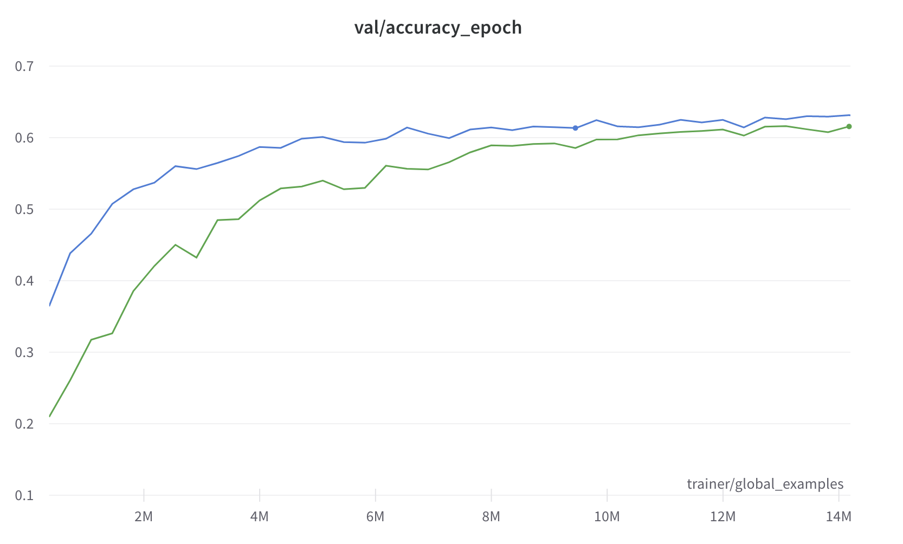

#######################################
 Welcome to Moonshine's documentation!
#######################################

**Moonshine** is a Python library that makes it easy for remote sensing
researchers, professionals, and enthusists to develop ML models on their
data. It provides pre-trained models across a variety of datasets and
architectures, allowing you to reduce your labeling costs and compute
requirements for your own application.

The above chart shows the difference between training the functional map
of the world classification task using our pre-trained model vs.
training from scratch. Training from scratch both performs worse
overall, and for the same level of accuracy we can train for 50% less
time. Check out the :doc:`usage` section for further information,
including how to :ref:`installation` the project.

.. note::

   This project is under active development.

**********
 Contents
**********

.. toctree::

   usage
   models
   api
